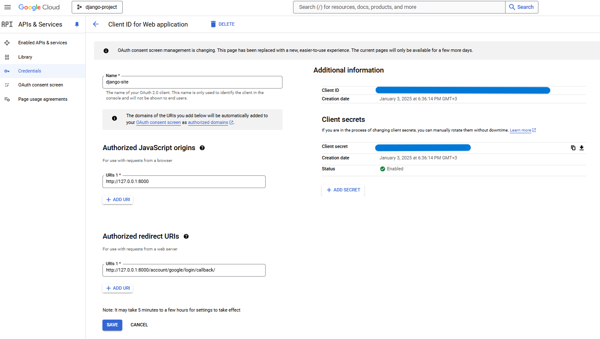
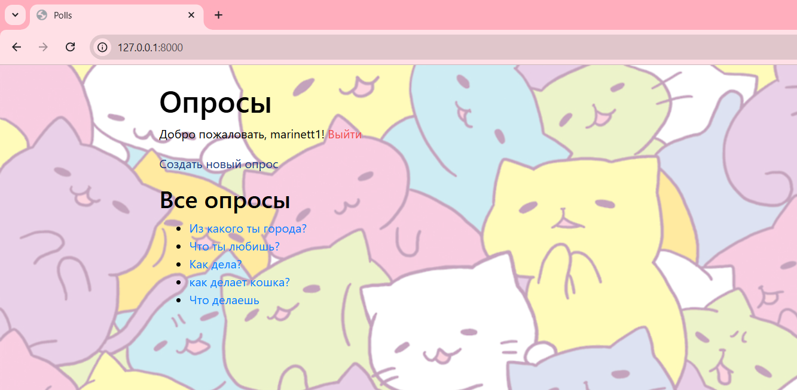

# Практическая работа - Настройка OAuth 2.0 авторизации в Django приложении (Django + OAuth + Google)

### 1. Начало работы
Для начала установили библиотеку ```django-allauth``` и добавим соответствующие изменения в файл ```setting.py```

```python
SITE_ID = 1

INSTALLED_APPS = [
    ...
    'django.contrib.sites',
    
    'allauth',
    'allauth.account',
    'allauth.socialaccount',
    'allauth.socialaccount.providers.google',
]

SOCIALACCOUNT_LOGIN_ON_GET=True

AUTHENTICATION_BACKENDS = [
    'allauth.account.auth_backends.AuthenticationBackend'
    ]

SOCIALACCOUNT_PROVIDERS = {
    'google': {
        'SCOPE': [
            'profile',
            'email',
        ],
        'AUTH_PARAMS': {
            'access_type': 'online',
        }
    }
}

LOGIN_REDIRECT_URL = '/'  
LOGOUT_REDIRECT_URL = '/' 
ACCOUNT_LOGOUT_ON_GET = True  

```
### 2. Далее перейдем к редактированию шаблонов и настройки маршрутов

Добавим кнопку для входа через Google аккаунт в шаблон ```polls/login.html```. Шаблон примет следующий вид:

```html
<link rel="stylesheet" href="https://cdnjs.cloudflare.com/ajax/libs/font-awesome/5.15.1/css/all.min.css">



  <h2>Вход</h2>
  <form method="post">
    
    {{ form.as_p }}
    <button type="submit" class="btn btn-primary">Войти</button>
  </form>

  <div class="mt-3">
    <button class="btn btn-outline-info">
      <a href="">
        <i class="fab fa-google"></i>
        Вход через Google
      </a>
    </button>
  </div>

```

Настроим маршруты в ```mysite/urls.py```, добавив ```path("", include("allauth.urls"))```. Получим в итоге:

```python
from django.contrib import admin
from django.urls import include, path

urlpatterns = [
    path("", include("polls.urls", namespace='polls')),
    path('admin/', admin.site.urls),
    path("account/", include("allauth.urls")),
]
```

### 3. Настройка API Google
Через Google Developers Console создадим новый проект. Мы создали наш проект, поэтому нам нужно создать нашего клиента OAuth. Для этого мы переходим на вкладку навигации "Credential" и нажимаем кнопку "create credentials", а из списка опций выбираем "OAuth client ID".  
В следующем окне выбираем «Веб-приложение», которому даем имя «django-site» и далее добавляем URI, как на скриншоте:



Далее нам понадобятся "Your Client ID" и "Your Client Secret".

Зайдем в Django Admin нашего приложения. Затем в разделе Sites добавим и введем 127.0.0.1:8000 в обе строки.
Далее в Social Accounts -> Social applications -> Add и введем следующие значения:
* Provider: Google
* Provider ID:
* Name: django-site
* Client id: вводим полученный ранее Your Client ID
* Secret key: вводим полученный ранее Your Client Secret
* Key:
* Settings:{}
* Sites: 127.0.0.1:8000
и сохраняем полученный результат

Перейдем к скриншотам. 

Теперь так выглядит страница входа:


Если нажимаем кнопку "Вход через Google":




Мы успешно вошли в аккаунт через Google account!


Полный код и содержание веб-приложения представлены в ветке [master](https://github.com/MarinaVasilevaIVT/django_project3/tree/master)

## Дополнительные задачи

[Официальная документация django-allauth](https://django-allauth.readthedocs.io/en/latest/)
[Аутентификация OAuth в Django с помощью social-auth](https://django.fun/articles/tutorials/autentifikaciya-oauth-v-django-s-pomoshyu-social-auth/)
[Авторизация через Google · Django в примерах - pocoz](https://pocoz.gitbooks.io/django-v-primerah/content/glava-4-sozdanie-social-website/avtorizatsiya-cherez-sotsialnie-seti/avtorizatsiya-cherez-google.html)
